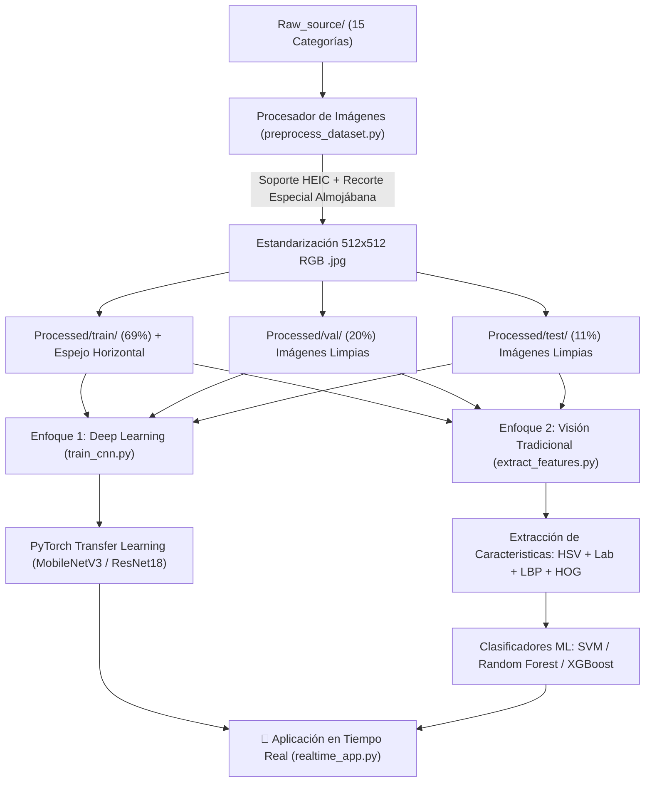

# 🇨🇴 Colombian Food Computer Vision Classification Pipeline

Un pipeline completo e industrial de **Visión Artificial y Aprendizaje Automático** para la estandarización, aumento de datos, extracción de características y clasificación automática de **15 comidas típicas colombianas**.

---

## 📌 Arquitectura del Pipeline



---

## 🍲 Categorías de Comida Colombiana (15 Clases)

1. **Almojábana**
2. **Arepa**
3. **Arepa de huevo**
4. **Buñuelo**
5. **Chorizo**
6. **Empanada**
7. **Morcilla**
8. **Palito de queso**
9. **Panceroti**
10. **Papa rellena**
11. **Papitas criollas**
12. **Pastel de hojaldre**
13. **Patacón**
14. **Salchipapas**
15. **Tamal**

---

## ⚙️ Características Técnicas del Preprocesamiento

- **Estandarización de Resolución**: **512x512 píxeles** en formato de color RGB `.jpg`.
- **Soporte Multi-formato (HEIC, PNG, JPG, WEBP)**: Conversión automática de imágenes de iPhone en formato `.HEIC` a JPEG estándar mediante `pillow_heif`.
- **Recorte Adaptativo para Almojábana HEIC**: Las imágenes HEIC de la categoría *Almojábana* poseen el objeto enfocado en la sección inferior. El algoritmo aplica un recorte ajustado en la parte inferior (`y_start = height - target_square_dim`), descartando el fondo superior innecesario.
- **División Estratificada**:
  - **Entrenamiento (Train)**: 69%
  - **Validación (Val)**: 20%
  - **Pruebas (Test)**: 11%
- **Aumento de Datos (Data Augmentation)**: Duplicación en **espejo horizontal (eje vertical)** aplicada **exclusivamente al conjunto de Entrenamiento (Train)** para evitar fugas de datos (*data leakage*) en validación y prueba.

---

## 🧠 Modelos de Clasificación

### 1. Visión Computacional Tradicional (`extract_features.py`)
Extracción de descriptores visuales específicos para alimentos:
- **Espacios de Color (HSV y Lab)**: Histogramas 3D y 1D para identificar tonalidades doradas, amarillas y oscuras.
- **Texturas (Local Binary Patterns - LBP)**: Patrones de masa frita, miga de pan, hojaldre y carnes.
- **Bordes y Forma (HOG - Histogram of Oriented Gradients)**: Geometría de buñuelos circulares, empanadas en media luna, patacones planos, etc.
- **Clasificadores Entrenados**: Support Vector Machine (SVM RBF), Random Forest y XGBoost.

### 2. Redes Neuronales / Deep Learning (`train_cnn.py`)
- **Transfer Learning** con `torchvision.models.mobilenet_v3_small` y `resnet18` ajustados a 15 clases.
- Programación de tasa de aprendizaje con *Cosine Annealing* y optimizador `AdamW`.

---

## 🚀 Guía de Uso e Instalación

### 1. Requisitos Previos e Instalación

```bash
pip install -r requirements.txt
```

### 2. Ejecutar Preprocesamiento de Imágenes

```bash
python preprocess_dataset.py
```

### 3. Entrenar Clasificadores Tradicionales (Feature Extraction + ML)

```bash
python extract_features.py
```

### 4. Entrenar Red Neuronal (CNN PyTorch)

```bash
python train_cnn.py --model mobilenet_v3_small --epochs 10 --batch_size 16
```

### 5. Lanzar Aplicación en Tiempo Real con Cámara Web
### 5. Optimizador de Hiperparámetros (Optuna) y Entrenamiento Extendido (CNN PyTorch)

```bash
python optimize_cnn.py --n_trials 8 --final_epochs 25
```

### 6. Lanzar Aplicación en Tiempo Real con Cámara Web

#### Opción A: Interfaz Web Interactiva (Streamlit)
```bash
streamlit run realtime_app.py
```

#### Opción B: Ventana Directa de OpenCV
```bash
python realtime_app.py --opencv
```

---

## 📁 Estructura del Proyecto

```
ArtificialVision_ColombianFood/
├── Raw_source/                 # Imágenes originales por categoría
├── Processed/                  # Dataset procesado a 512x512 px
│   ├── train/                  # 69% + imágenes en espejo (flipped)
│   ├── val/                    # 20% originales
│   ├── test/                   # 11% originales
│   └── dataset_summary.json    # Metadatos del dataset
├── models/                     # Checkpoints y modelos guardados (.pth, .pkl)
├── preprocess_dataset.py       # Script de estandarización y aumentación
├── extract_features.py         # Pipeline CV Tradicional (HSV+LBP+HOG + ML)
├── train_cnn.py                # Pipeline Deep Learning básico (PyTorch CNN)
├── optimize_cnn.py             # Búsqueda de hiperparámetros (Optuna) + Entrenamiento 25 Épocas
├── realtime_app.py             # Aplicación de detección en tiempo real con cámara
├── ColombianFood_Vision_Pipeline.ipynb # Notebook interactivo completo
├── requirements.txt            # Dependencias del proyecto
└── README.md                   # Documentación principal
```
